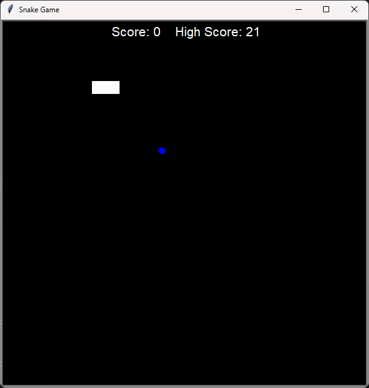

# Snake Game

## Description
Snake Game is a classic game where the player controls a snake to eat food and grow in length. The game ends when the snake hits a wall or itself. The player's score is recorded and compared with the high score.

## Gameplay



## Technologies Used
- Python
- Turtle Graphics

## Features
- **Snake Control**: The player can control the snake using the arrow keys (up, down, left, right) or the W, A, S, D keys.
- **Food Collection**: The snake grows when it eats food, and the player's score is updated.
- **High Score Recording**: The high score is saved in the `high_score.txt` file and displayed on the screen.
- **Game Over**: The game ends when the snake hits a wall or itself, and the score is compared with the high score.

## Files
- `main.py`: The main file to run the game.
- `snake.py`: The Snake class that manages the snake's movement and collisions.
- `food.py`: The Food class that manages the food's position.
- `scoreboard.py`: The Scoreboard class that manages the score and high score.
- `high_score.txt`: The file that stores the high score.

## Installation and Setup

1. **Clone the Repository**  
   ```bash
   git clone https://github.com/WinterWollf/Snake.git
   ```

2. **Run the Game**  

    ```bash
    cd src
    python main.py
    ```

## License

This project is licensed under the MIT License - see the [LICENSE](LICENSE.txt) file for details.

## Contact

For any inquiries or feedback, feel free to reach out to the project author:
- **GitHub**: [WinterWollf](https://github.com/WinterWollf)

---